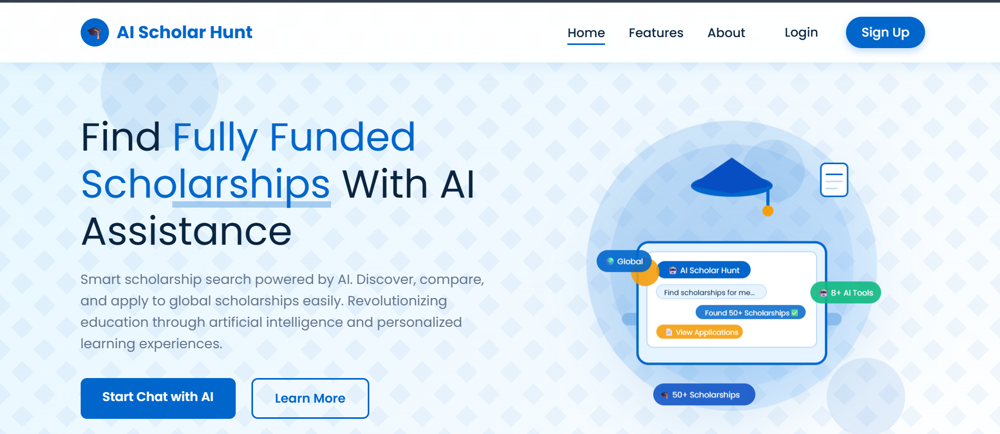

<div align="center">


</div>

<div align="center">

[](https://asad-aziz-ai-scholar-hunt.hf.space/)

</div>

---

<div align="center">

### ⚡ LIVE PLATFORM

[](https://asad-aziz-ai-scholar-hunt.hf.space/)
&nbsp;
[](https://github.com/Asad-Aziz-001)
&nbsp;
[](mailto:aischolarhunt@gmail.com)

</div>

---

<div align="center">

## 🧬 TECH DNA

| | | | |
|:---:|:---:|:---:|:---:|
|  |  |  |  |
|  |  |  |  |
|  |  |  |  |

</div>

---

<div align="center">

## 📊 PROJECT AT A GLANCE

| 🎓 | 🌍 | 🤖 | 🛠️ | 📄 | 🔐 |
|:---:|:---:|:---:|:---:|:---:|:---:|
| **51+** | **20+** | **3-Layer** | **13+** | **2 Formats** | **100%** |
| Scholarships | Countries | AI Engine | Tools | PDF & DOCX | Secure Auth |

</div>

---

<br/>

> **💡 What is AI Scholar Hunt?**
>
> AI Scholar Hunt is a production-grade, full-stack scholarship intelligence platform built for Pakistani students seeking international education. It combines a custom-built RAG pipeline, advanced Prompt Engineering, and a 51-scholarship knowledge base into 13+ specialized AI tools — all without a single paid API key. From chatbot to CV generation to application tracking, everything runs locally with enterprise-grade architecture.

---

## 📌 TABLE OF CONTENTS

<div align="center">

| # | Section |
|:---:|---|
| 01 | [🎯 Problem Statement](#-problem-statement) |
| 02 | [🏗️ System Architecture](#-system-architecture) |
| 03 | [🤖 AI Engine — Deep Dive](#-ai-engine--deep-dive) |
| 04 | [🚀 Feature Suite — All 13 Tools](#-feature-suite--all-13-tools) |
| 05 | [📸 Screenshots](#-screenshots) |
| 06 | [🗂️ Project Structure](#-project-structure) |
| 07 | [⚙️ Tech Stack](#-tech-stack) |
| 08 | [🌍 CV Builder — 14 Countries](#-cv-builder--14-countries) |
| 09 | [📊 Scholarship Knowledge Base](#-scholarship-knowledge-base) |
| 10 | [🔐 Authentication System](#-authentication-system) |
| 11 | [🧩 Blueprint Architecture](#-blueprint-architecture) |
| 12 | [🛠️ Installation & Setup](#-installation--setup) |
| 13 | [👨‍💻 Authors](#-authors) |

</div>

---

## 🎯 Problem Statement

<div align="center">

> *Pakistani students lose life-changing scholarship opportunities every year — not because they lack merit, but because they lack the right tools.*

</div>

| ❌ The Problem | ✅ How We Solve It |
|---|---|
| Hundreds of scholarships, impossible to track manually | AI chatbot answers any query instantly from a 51-scholarship database |
| No personalized eligibility check | Smart scoring algorithm checks your profile against 8+ scholarships simultaneously |
| CV format varies wildly by country | CV Builder generates country-specific CVs for 14 nations with correct format |
| Generic SOPs get rejected | AI Strength Analyzer gives expert-level feedback on your essays and CVs |
| Students miss deadlines | Application Tracker + Timeline Visualizer keeps every deadline visible |
| Hidden costs catch students off guard | Cost Estimator breaks down every financial aspect of studying abroad |
| Incomplete applications due to missing documents | Document Checklist Generator ensures nothing is missed |
| No guidance on where to start | AI Mentor provides personalized scholarship counseling on demand |

---

## 🏗️ System Architecture

```
┌─────────────────────────────────────────────────────────────────────┐
│                        AI SCHOLAR HUNT                              │
│                     Full-Stack Architecture                         │
└─────────────────────────────────────────────────────────────────────┘

  ┌──────────────────────────────────────────────────────────────┐
  │                      FRONTEND LAYER                          │
  │   HTML5 · CSS3 · JavaScript · Jinja2 · Dark/Light Theme      │
  │   Glassmorphism UI · Animated Elements · Fully Responsive    │
  └──────────────────────┬───────────────────────────────────────┘
                         │ HTTP Requests
  ┌──────────────────────▼───────────────────────────────────────┐
  │                   FLASK APPLICATION LAYER                    │
  │                                                              │
  │  auth_bp ── profile_bp ── preferences_bp ── security_bp     │
  │                         cv_bp                               │
  │                                                              │
  │  Routes: chatbot · eligibility · comparison · tracker       │
  │          cost_estimator · timeline · checklist · mentor     │
  │          sop_writer · ats_checker · strength_analyzer       │
  └──────────────────────┬───────────────────────────────────────┘
                         │
         ┌───────────────┴───────────────┐
         │                               │
  ┌──────▼──────┐               ┌────────▼────────┐
  │  SQLite DB  │               │   AI ENGINE      │
  │             │               │                  │
  │ Users       │               │  Knowledge Base  │
  │ Profiles    │               │  (51+ files)     │
  │ Tracker     │               │       ↓          │
  │ Sessions    │               │  Scoring Algo    │
  └─────────────┘               │       ↓          │
                                │  Prompt Engine   │
                                └──────────────────┘
```

---

## 🤖 AI Engine — Deep Dive

AI Scholar Hunt runs a **3-layer AI pipeline** with zero dependency on any commercial LLM API.

---

### Layer 1 — Knowledge Base (Retrieval Foundation)

The scholarship knowledge base consists of 51+ individually structured `.txt` files. Each file stores a single scholarship's complete data in JSON format with 15+ fields — name, country, institution, study level, deadline, coverage amount, eligibility criteria, required documents, available courses, duration, apply link, and additional notes. All files are loaded into memory at application startup for millisecond-level retrieval speed.

---

### Layer 2 — Scoring Algorithm (Augmented Retrieval)

When a user submits a query, the engine normalizes the input, strips stop words, and tokenizes it. Every scholarship in the knowledge base is then scored in real time using a weighted relevance model.

| Signal | Weight | Example |
|---|---|---|
| Exact scholarship name match | ⭐⭐⭐⭐⭐ Highest | Query contains "DAAD" |
| Country name match | ⭐⭐⭐⭐ High | Query contains "Germany" |
| Institution name match | ⭐⭐⭐ Medium-High | Query contains "Humboldt" |
| Study level match | ⭐⭐⭐ Medium | Query contains "masters" or "PhD" |
| Full-text keyword hit | ⭐⭐ Low | Any word found anywhere in file |

Results are ranked by cumulative score, and the top matches are selected for response generation.

---

### Layer 3 — Prompt Engineering (Response Generation)

Responses are generated through carefully engineered prompt templates that produce structured, readable output every time. The engine operates in three response modes depending on match quality.

**Exact Match Mode** — When a specific scholarship is identified, the full details are returned in a structured markdown card with all 15+ fields, emoji-enhanced for readability, and a direct apply link.

**General Query Mode** — When no single match is dominant, the top 3 ranked scholarships are returned with summary cards and a follow-up suggestion to narrow down the search.

**No Match Mode** — When no relevant scholarship is found, the engine does not return an empty response. Instead it suggests the closest related scholarships from the knowledge base and guides the user toward a better query.

Every response ends with embedded follow-up prompts to maintain conversational flow and encourage deeper exploration.

---

## 🚀 Feature Suite — All 13 Tools

<div align="center">

### 🔵 CORE AI TOOLS

</div>

---

**🤖 01 — AI-Powered Scholarship Chatbot**

The flagship feature of the platform. Students ask natural language questions about any scholarship — deadlines, eligibility, funding coverage, required documents, application process — and receive instant, structured, markdown-formatted answers pulled from the local knowledge base. The chatbot handles follow-up queries, suggests related scholarships, and maintains conversational context throughout the session.

---

**✅ 02 — Eligibility Checker**

Students input their academic profile — CGPA, degree level, field of study, target country, language test scores, and work experience. The eligibility engine scores the profile against 8+ scholarships simultaneously using a custom multi-criteria algorithm and returns a match percentage for each scholarship, along with specific feedback on which criteria are met and which fall short. This prevents students from wasting time applying to scholarships they do not qualify for.

---

**💪 03 — Application Strength Analyzer**

Students paste their Statement of Purpose, personal essay, or CV text. The analyzer evaluates the content against scholarship-specific criteria using Prompt Engineering that simulates an experienced scholarship reviewer. The output includes identified strengths, specific weaknesses, and concrete rewriting suggestions — transforming a generic application into a targeted one.

---

**📝 04 — Essay & SOP Writing Assistant**

A full AI-guided drafting environment for scholarship essays and Statements of Purpose. The assistant helps students structure their narrative, articulate their research or career goals, highlight relevant achievements, and calibrate tone to the specific scholarship. Supports three distinct essay styles — motivational, research-focused, and career-oriented — so every application feels authentic and tailored.

---

**📄 05 — ATS CV Checker**

Designed for scholarships that use Applicant Tracking Systems for initial screening. Students paste their CV alongside a scholarship or job description. The checker returns an ATS compatibility score, a list of matched keywords already present in the CV, a list of critical missing keywords, and specific suggestions for each gap. Ensures the CV survives automated screening before a human ever reads it.

---

<div align="center">

### 🔵 PLANNING & INTELLIGENCE TOOLS

</div>

---

**📊 06 — Scholarship Comparison Tool**

Students select up to 3 scholarships and view them in a side-by-side structured comparison table. The table covers funding amount, coverage type, eligible degree levels, nationality requirements, language requirements, application deadline, required documents, and direct apply links — all in one view. Eliminates the need to open multiple browser tabs and manually compare information.

---

**💰 07 — Study Abroad Cost Estimator**

A financial reality check before students commit to an application. Students input their target country and degree level and the estimator returns a detailed breakdown — monthly living costs, average tuition range, visa and application fees, health insurance costs, estimated flight costs, and a total budget estimate for the full study duration. Helps students identify which scholarships offer sufficient funding for their specific destination.

---

**📅 08 — Application Timeline Visualizer**

Generates a personalized, month-by-month application roadmap from today until the scholarship deadline. The timeline is divided into structured phases — initial research, document gathering, language test preparation, recommendation letter requests, essay drafting, final review, and submission. Each phase includes recommended tasks and time allocations. Students who use the timeline are significantly less likely to miss critical milestones.

---

**📋 09 — Document Checklist Generator**

Every scholarship has a unique document requirement list that varies by country, institution, and study level. The checklist generator produces a fully customized, interactive checklist based on the student's selected scholarship and target country. Items span academic transcripts, recommendation letters, language test certificates, financial documents, passport copies, and more. Students can tick off items as they gather them to track readiness in real time.

---

**🧑‍🏫 10 — AI Scholarship Mentor**

A conversational AI that functions as a personal scholarship counselor. Unlike the chatbot which retrieves information, the Mentor engages in strategic dialogue — helping students assess their profile, identify their strongest scholarship matches, plan their application sequence, and build confidence. The Mentor simulates the experience of a one-on-one session with an experienced international education advisor.

---

<div align="center">

### 🔵 MANAGEMENT & PRODUCTIVITY TOOLS

</div>

---

**📌 11 — Application Tracker**

A personal CRM for scholarship applications. Students add every scholarship they are pursuing and track it through a defined status pipeline — Researching, Preparing Documents, Writing Essays, Submitted, Interview Stage, Accepted, Rejected. Each entry stores the scholarship name, deadline, current status, priority level, and personal notes. The tracker dashboard gives a bird's-eye view of the entire application pipeline at once.

---

**🌍 12 — Multi-Country CV Builder**

Generates professionally formatted, submission-ready CVs tailored to the specific CV conventions of 14 countries across 4 template groups. Handles photo embedding for countries that require it, adds country-specific personal fields like passport number and nationality, and applies the correct section ordering and formatting conventions per region. Exports in both PDF and DOCX formats so students can submit in whichever format the scholarship portal requires.

---

**👤 13 — User Profile & Account System**

A complete user management system with registration, secure login, profile editing, avatar upload, theme preferences, language settings, and a profile completion tracker. Includes a full password reset flow via email with a time-limited secure token. All routes are protected and all passwords are hashed — no plain-text storage at any point.

---

## 📸 Screenshots

> Create a `screenshots/` folder in the repository root and place your images there with the filenames below — they will render automatically on GitHub.

<div align="center">

### 🏠 Landing Page


</div>

---

## 🗂️ Project Structure

```
AI-Scholar-Hunt/
│
├── 📄 app.py                           # Main Flask Application Entry Point
├── 🤖 chatbot.py                       # AI Chatbot — RAG + Prompt Engine
├── 📊 comparison.py                    # Scholarship Comparison Logic
├── 💰 cost_estimator.py               # Study Abroad Cost Estimation Engine
├── 📅 timeline_visualizer.py          # Application Timeline Generator
├── 📋 checklist_generator.py          # Country-Specific Document Checklist
├── 🧑‍🏫 mentor.py                     # AI Scholarship Mentor Engine
├── 🧠 models.py                        # SQLAlchemy Database Models
├── 📧 email_service.py                # Email Service — Flask-Mail + SMTP
├── 🔧 utils.py                         # Shared Utility Functions
├── ⚙️ config.py                        # App Configuration & Environment
├── 📦 requirements.txt                 # Python Package Dependencies
│
├── 🗄️ database/
│   └── scholarhunt.db                  # SQLite Database
│
├── 📚 scholarships/                    # Knowledge Base — 51+ Files
│   ├── daad_scholarship.txt
│   ├── fulbright_scholarship.txt
│   ├── australia_awards.txt
│   ├── beijing_government.txt
│   ├── khalifa_university.txt
│   └── ... (46 more files)
│
├── 🎨 templates/                       # Jinja2 HTML Templates
│   ├── index.html                      # Landing Page
│   ├── dashboard.html                  # User Dashboard
│   ├── login.html / signup.html        # Auth Pages
│   ├── chatbot.html                    # AI Chatbot UI
│   ├── eligibility.html               # Eligibility Checker UI
│   ├── strength_analyzer.html          # Strength Analyzer UI
│   ├── sop_writer.html                # SOP Writing Assistant UI
│   ├── ats_checker.html               # ATS CV Checker UI
│   ├── comparison.html                # Comparison Tool UI
│   ├── cost_estimator.html            # Cost Estimator UI
│   ├── timeline_visualizer.html       # Timeline Visualizer UI
│   ├── checklist_generator.html       # Checklist Generator UI
│   ├── mentor.html                     # AI Mentor UI
│   ├── tracker.html                    # Application Tracker UI
│   ├── profile.html                    # User Profile UI
│   ├── cv_builder.html                # CV Builder Landing
│   └── cv_form.html                    # CV Builder Form
│
├── 🔐 auth/
│   └── routes.py                       # Login · Signup · Password Reset
│
├── 👤 user_profile/
│   └── routes.py                       # Profile · Edit · Preferences
│
└── 🧩 blueprints/
    └── cv.py                            # CV Builder · Generation · Export
```

---

## ⚙️ Tech Stack

<div align="center">

| Layer | Technology | Role |
|:---:|:---:|---|
| **Core Language** | Python 3.10+ | Backend logic, AI engine, data processing |
| **Web Framework** | Flask 2.3 | Routing, blueprints, middleware, request handling |
| **Database ORM** | SQLAlchemy | Model definitions, queries, session management |
| **Database** | SQLite | Lightweight persistent storage — users, sessions, tracker |
| **Auth System** | Flask-Login | Session management, route protection, current_user |
| **Security Tokens** | itsdangerous | Time-limited password reset token generation and validation |
| **Email Service** | Flask-Mail + smtplib | Password reset emails — SSL/TLS with SMTP fallback |
| **PDF Export** | ReportLab | Country-specific CV PDF generation with custom layouts |
| **DOCX Export** | python-docx | CV Word document generation with formatted sections |
| **Image Processing** | Pillow (PIL) | CV photo resizing, cropping, and embedding |
| **AI Engine** | Custom RAG Pipeline | Scholarship retrieval, scoring, and response generation |
| **Response Design** | Prompt Engineering | Structured markdown output across 3 response modes |
| **Frontend** | HTML5 · CSS3 · JavaScript · Jinja2 | Templated UI with dark/light themes and glassmorphism |
| **Cross-Origin** | Flask-CORS | API access from frontend without CORS errors |

</div>

---

## 🌍 CV Builder — 14 Countries

<div align="center">

| Group | Countries | CV Format | Photo Required | Unique Fields |
|:---:|:---:|:---:|:---:|---|
| **Group A** | 🇺🇸 USA · 🇨🇦 Canada · 🇦🇺 Australia · 🇮🇪 Ireland | ATS-Friendly Resume | ❌ No | LinkedIn URL, GitHub Profile |
| **Group B** | 🇩🇪 Germany · 🇦🇹 Austria · 🇹🇷 Turkey | Lebenslauf Format | ✅ Yes | Date of Birth, Nationality, Marital Status |
| **Group C** | 🇨🇳 China · 🇦🇪 UAE · 🇯🇵 Japan | Passport/Visa-Ready | ✅ Yes | Passport Number, Visa Status |
| **Group D** | 🇧🇪 Belgium · 🇩🇰 Denmark · 🇮🇹 Italy · 🇫🇷 France | Europass Standard | ❌ No | Language Proficiency (mandatory) |

</div>

**CV Sections Generated:** Personal Information → Education History → Work Experience → Projects → Technical Skills → Languages → Certifications → Publications → References

**Export Formats:** `.pdf` via ReportLab (print-ready) and `.docx` via python-docx (editable)

---

## 📊 Scholarship Knowledge Base

<div align="center">

| Metric | Value |
|:---:|:---:|
| Total Scholarships | **51+** |
| Countries Covered | **20+** |
| Data Fields per Entry | **15+** |
| File Format | JSON-structured `.txt` |
| Retrieval Speed | Millisecond-level (in-memory) |
| Update Frequency | Manually curated per cycle |

</div>

**Fields stored per scholarship:** scholarship_name · study_in · institution · level_of_study · deadline · coverage_amount · coverage_type · eligibility_criteria · required_documents · available_courses · study_duration · language_requirements · apply_link · official_website · additional_notes

**Sample scholarships in the database:**

🇩🇪 DAAD Scholarship 2026–27 &nbsp;·&nbsp; 🇺🇸 Fulbright Scholarship 2026–27 &nbsp;·&nbsp; 🇦🇺 Australia Awards 2026–27 &nbsp;·&nbsp; 🇨🇳 Beijing Government Scholarship 2026–27 &nbsp;·&nbsp; 🇨🇦 Carleton University Entrance Awards &nbsp;·&nbsp; 🇰🇷 Korean Government Scholarship KGSP &nbsp;·&nbsp; 🇦🇪 Khalifa University — Fully Funded &nbsp;·&nbsp; 🇮🇹 University of Bologna Scholarship &nbsp;·&nbsp; 🇧🇪 Master Mind Scholarships Belgium &nbsp;·&nbsp; 🇹🇷 Türkiye Bursları Government Scholarship &nbsp;·&nbsp; and **41 more**

---

## 🔐 Authentication System

**Registration & Login**

Students register with full name, email address, and password. Passwords are hashed using a secure algorithm before storage — plain-text passwords are never written to the database. Flask-Login manages session state across requests. All dashboard, tool, and profile routes are protected and redirect unauthenticated users to the login page.

**Password Reset Pipeline**

The user submits their registered email address on the forgot-password page. The server generates a cryptographically secure, time-limited token using itsdangerous with a one-hour expiry window. A branded HTML email is dispatched via Flask-Mail with a direct SMTP fallback across 5 retry attempts on ports 465 and 587. The user opens the link, sets a new password, and the token is consumed and invalidated immediately after use.

---

## 🧩 Blueprint Architecture

Each functional area of the application is encapsulated in its own Flask Blueprint, registered once in `app.py` after app initialization. This eliminates duplicate route conflicts and keeps the codebase cleanly separated by concern.

<div align="center">

| Blueprint | URL Prefix | Responsibilities |
|:---:|:---:|---|
| `auth_bp` | `/` | Login · Signup · Logout · Forgot Password · Reset Password |
| `profile_bp` | `/` | View Profile · Edit Profile · Avatar Upload |
| `preferences_bp` | `/` | Theme Settings · Language Preferences |
| `security_bp` | `/` | Change Password · Security Settings |
| `cv_bp` | `/cv-builder` | CV Landing · Country Form · Generation · PDF & DOCX Export |

</div>

---

## 🛠️ Installation & Setup

**Step 1 — Clone the Repository**

```
git clone https://github.com/Asad-Aziz-001/ai-scholar-hunt.git
cd ai-scholar-hunt
```

**Step 2 — Create and Activate a Virtual Environment**

```
python -m venv venv
```

Windows: `venv\Scripts\activate` &nbsp;|&nbsp; Mac/Linux: `source venv/bin/activate`

**Step 3 — Install All Dependencies**

```
pip install -r requirements.txt
```

**Step 4 — Configure the Application**

Open `config.py` and set your `SECRET_KEY`, Gmail credentials, and App Password.

**Step 5 — Run the Application**

```
python app.py
```

**Step 6 — Open in Browser**

Navigate to `http://127.0.0.1:5000` — the platform is live.

---

## 📁 Environment Configuration

Open `config.py` and fill in your environment values before running the app.

| Setting | Description |
|---|---|
| `SECRET_KEY` | Any strong random string — used for session signing |
| `SQLALCHEMY_DATABASE_URI` | Leave as `sqlite:///scholar.db` for local development |
| `MAIL_SERVER` | `smtp.gmail.com` |
| `MAIL_PORT` | `587` for TLS · `465` for SSL |
| `MAIL_USE_TLS` | `True` when using port 587 |
| `MAIL_USERNAME` | Your Gmail address |
| `MAIL_PASSWORD` | Your Gmail App Password — not your account password |
| `MAIL_DEFAULT_SENDER` | Same as your Gmail address |
| `MAX_CONTENT_LENGTH` | `16 * 1024 * 1024` for 16 MB file upload limit |

> 💡 **Gmail App Password:** Go to Google Account → Security → 2-Step Verification → App Passwords → Select app: Mail → Generate. Use the 16-character code as your `MAIL_PASSWORD`.

---

## 📦 Full Requirements

The following packages power the application. Complete version-pinned list is in `requirements.txt`.

Flask · Flask-Login · Flask-Mail · Flask-CORS · Flask-SQLAlchemy · itsdangerous · python-docx · reportlab · Pillow

---

## 👨‍💻 Authors

<div align="center">


</div>

### 🧑‍💻 Asad Aziz

*AI Engineer · Full-Stack Developer · Project Lead*

[](https://github.com/Asad-Aziz-001)

[](https://www.linkedin.com/in/asad-aziz-ai)

</td>
<td align="center" width="50%">

### 🧑‍💻 Tayyab Zunair

*AI Engineer · Full-Stack Developer*

[](https://github.com/Tayyabzunair)

[](https://www.linkedin.com/in/mtayyabzunair)

</td>
</tr>
</table>

[](mailto:aischolarhunt@gmail.com)

<br/>

---

### 🎓 Project Identity Card

<div align="center">

| Field | Detail |
|:---:|:---:|
| **Project Type** | Final Year Project (FYP) |
| **Year** | 2026 |
| **Department** | Artificial Intelligence |
| **Domain** | Generative AI · EdTech |
| **Focus** | Scholarship Intelligence for Pakistani Students |
| **AI Techniques** | LLM · RAG · Prompt Engineering |
| **Tools Built** | 13+ AI-Powered Features |
| **Scholarships** | 51+ across 20+ Countries |
| **External API Keys** | ❌ Zero Required |
| **Deployment** | HuggingFace Spaces |

</div>

<br/>

---

<br/>

*"The right scholarship, found at the right time, changes a student's entire life trajectory. AI Scholar Hunt exists to make that moment happen — for every Pakistani student who dares to dream beyond borders."*

<br/>


<br/>


&nbsp;

&nbsp;


<br/>


</div>
